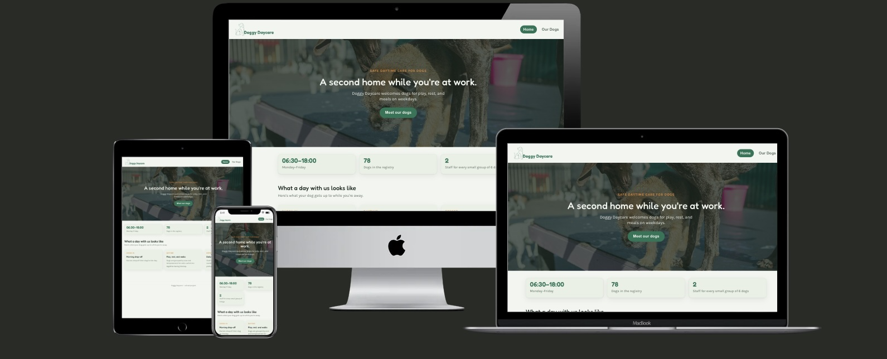

# Doggy Daycare



A responsive web app for a fictional dog daycare, built as a group project for our school assignment. Visitors can browse the registry of dogs currently in the daycare's care and view individual dog profiles.

**Live site:** [Doggy Daycare](https://linnea87.github.io/doggy-daycare/)

## About the project

Doggy Daycare lets you browse a catalog of dogs registered at the daycare, see which ones are checked in, and view a full profile for each dog. The dog data is fetched live from a JSON API, so the registry always reflects the current dataset rather than hardcoded content.


## Features

- **Home** – landing page with a hero section, quick stats (opening hours, number of registered dogs, staff-to-dog ratio) and an overview of what a day at daycare looks like.
- **Dog Catalog** – a grid of every registered dog, fetched live from the API, with each card showing name, breed, age and check-in status. Filter buttons let you show all dogs, only those checked in, or only those at home.
- **Dog Profile** – a detailed view for an individual dog.
- Fully responsive, mobile-first layout.
- Light and dark mode support, following the visitor's system preference.

## Technologies used

- [React](https://react.dev/) – UI components
- [Vite](https://vitejs.dev/) – build tool and dev server
- [JSONBin](https://jsonbin.io/) – hosts the dog registry data as a JSON API
- Plain CSS with custom properties for theming (no CSS framework)
- [gh-pages](https://www.npmjs.com/package/gh-pages) – deployment to GitHub Pages

## Design

- Custom logo designed in Canva.
- Colour palette and typography defined as CSS custom properties in `index.css`, shared across the whole app.
- Fonts: [Fredoka](https://fonts.google.com/specimen/Fredoka) (headings) and [Karla](https://fonts.google.com/specimen/Karla) (body text), via Google Fonts.

## Running the project locally

```bash
git clone https://github.com/Linnea87/doggy-daycare.git
cd doggy-daycare
npm install
npm run dev
```

## Deployment

The site is built with Vite and deployed to GitHub Pages using the `gh-pages` package.

```bash
npm run build
npm run deploy
```

`vite.config.js` sets `base: "/doggy-daycare/"` so asset paths resolve correctly under the GitHub Pages subpath. GitHub repo settings: **Settings → Pages → Source** is set to the `gh-pages` branch.

## Future improvements

- Let staff add notes to a dog's profile.
- Convert images to WebP for better performance.

## Credits

- Dog photo on the homepage: [Pixabay](https://pixabay.com/sv/)
- Built by:
    -   [Linnéa Ternevik](https://github.com/Linnea87)
    -   [Erik Nordvall](https://github.com/eriknordvall)
    -   [Aurelie Vaudan](https://github.com/aurevau)
    -   [Neda Khalajnejad](https://github.com/Nedakhalaj) 

